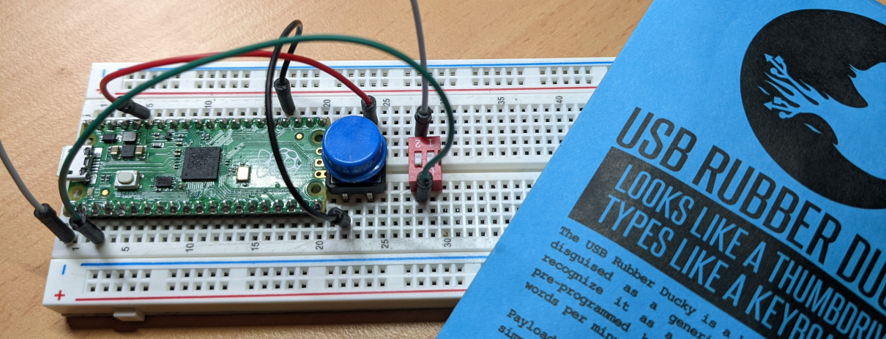

# PicoProject-Ducky

Project on how to use a Pico as a virtual keyboard and custom Rubber Ducky. It was created as a project for Uni but I have opened it so other can learn.

The package is broken down into 5 tasks.

* [Task 1: The Pico and Setup of envirnoment](https://github.com/CraigWilsonOZ/PicoProject-Ducky/blob/main/Task%201/readme.md)
* [Task 2: Setting up hard switch, LED and basic keyboard](https://github.com/CraigWilsonOZ/PicoProject-Ducky/blob/main/Task%202/readme.md)
* [Task 3: Loading files and sending keys](https://github.com/CraigWilsonOZ/PicoProject-Ducky/blob/main/Task%203/readme.md)
* [Task 4: Creating scripts and basic payloads](https://github.com/CraigWilsonOZ/PicoProject-Ducky/blob/main/Task%204/readme.md)
* [Task 5: Working with Payloads](https://github.com/CraigWilsonOZ/PicoProject-Ducky/blob/main/Task%205/readme.md)

These tasks will guide you on getting started with the Pico, setting up a virtual keybaord, reading files and sending keys to the computer. At the end of the process you will have a basic Rubber Ducky using your Pico.
