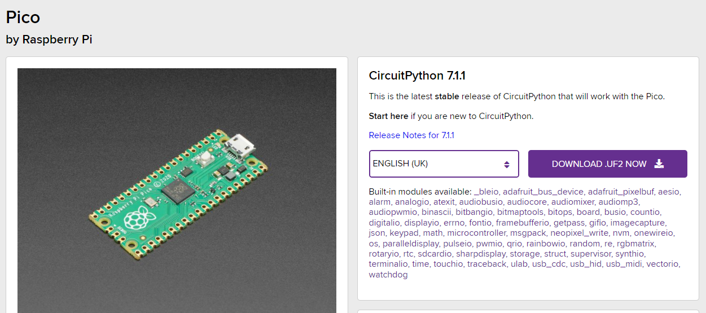

# Task 1: The Pico and Setup of envirnoment

The Raspberry Pi Pico (RP2040) is a small low-cost high-performance microcontroller. This device has supports running Micro Python and C/C++. It has several GPO Pins for integrations with external devices such as displays or sensors.

Raspberry Pi Pico key features include (<https://www.raspberrypi.com/documentation/microcontrollers/raspberry-pi-pico.html>):

* RP2040 microcontroller chip designed by Raspberry Pi in the United Kingdom
* Dual-core Arm Cortex M0+ processor, flexible clock running up to 133 MHz
* 264KB of SRAM, and 2MB of onboard Flash memory
* The castellated module allows soldering directly to carrier boards
* USB 1.1 with device and host support
* Low-power sleep and dormant modes
* Drag-and-drop programming using mass storage over USB
* 26 &times; multi-function GPIO pins
* 2 &times; SPI, 2 &times; I2C, 2 &times; UART, 3 &times; 12-bit ADC, 16 &times; controllable PWM channels
* Accurate clock and timer on-chip
* Temperature sensor
* Accelerated floating-point libraries on-chip
* 8 &times; Programmable I/O (PIO) state machines for custom peripheral support

The RP2040 board layout:


There are two main versions of Micro Python released at the time of writing. These are Micro Python and CircuitPython. Micro Python was the first release and contains the basic functions to run the Pico. CircuitPython is another version of Python but provides many device libraries for integration with other sensors and systems. For this reason, we will use CircuitPython.

To use a Raspberry Pi Pico, we need to do the following:

1. Get a Raspberry Pi Pico RP2040
2. Download a development environment so we can write come code
3. Download CircuitPython ([https://circuitpython.org/](https://circuitpython.org/))
4. Deploy CircuitPython to the Pi
5. Create our first program

**Getting a Raspberry Pi Pico.**

These boards are around $4 USD or $10 AUD. The devices can be purchased from local suppliers or via the [https://www.raspberrypi.com/products/raspberry-pi-pico/](https://www.raspberrypi.com/products/raspberry-pi-pico/) site, this site will redirect you to a local site in the country.

**Download CircuitPython:**

CircuitPython can be downloaded from here

[https://circuitpython.org/board/raspberry_pi_pico/](https://circuitpython.org/board/raspberry_pi_pico/)



**Development Environment.**

To work with the Raspberry Pi Pico we will need to use a development environment. This is where we can connect to the board and run out Python from. It will allow us to use libraries and capture console or log output.

CircuitPython recommends MU as the development environment. This can be downloaded from here: [https://codewith.mu/en/download](https://codewith.mu/en/download), once downloaded run the normal install process.

**Prepare the PICO.**

Once you have the development environment ready, the next step is getting the PICO ready. Connected the PICO to the computer via USB, it should mount as RPI-RP2. This provides access to the PICO as a USB disk, Copy the UF2 file downloaded from CircuitPython.org to the PICO. The PICO will restart and should now appear as a CIRCUITPY USB Disk.

On the PICO would see a CODE.PY file. This is where the code runs. Any python placed in that location will execute.

**Using the MU Editor.**

Once started click on the Serial Mode icon, now anything you type in the console will appear and run on the PICO.

Serial mode is REPL, Read, Execute, Print. Loop.

Try typing

```python
print(“Hello World”)
```

It should return "Hello World"

Next, Open the code.py file and paste this test program:

```python
import time
import board
import digitalio
 
led = digitalio.DigitalInOut(board.LED)
led.direction = digitalio.Direction.OUTPUT
 
while True:
    led.value = True
    time.sleep(0.5)
    led.value = False
    time.sleep(0.5)
```

This program will import 3 library files and set up the onboard LED. When it runs the PCIO board will flash its onboard LED.

Once completed move onto Task 2.

* [Task 1: The Pico and Setup of envirnoment](https://github.com/CraigWilsonOZ/PicoProject-Ducky/blob/main/Task%201/readme.md)
* [Task 2: Setting up hard switch, LED and basic keyboard](https://github.com/CraigWilsonOZ/PicoProject-Ducky/blob/main/Task%202/readme.md)
* [Task 3: Loading files and sending keys](https://github.com/CraigWilsonOZ/PicoProject-Ducky/blob/main/Task%203/readme.md)
* [Task 4: Creating scripts and basic payloads](https://github.com/CraigWilsonOZ/PicoProject-Ducky/blob/main/Task%204/readme.md)
* [Task 5: Working with Payloads](https://github.com/CraigWilsonOZ/PicoProject-Ducky/blob/main/Task%205/readme.md)
