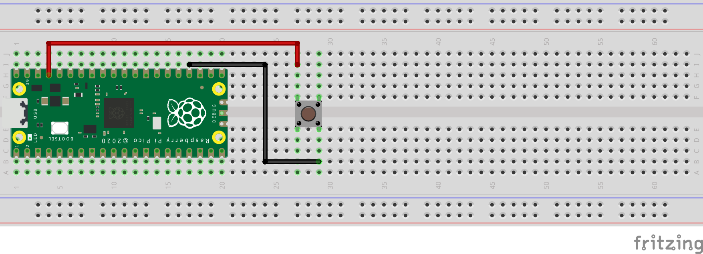
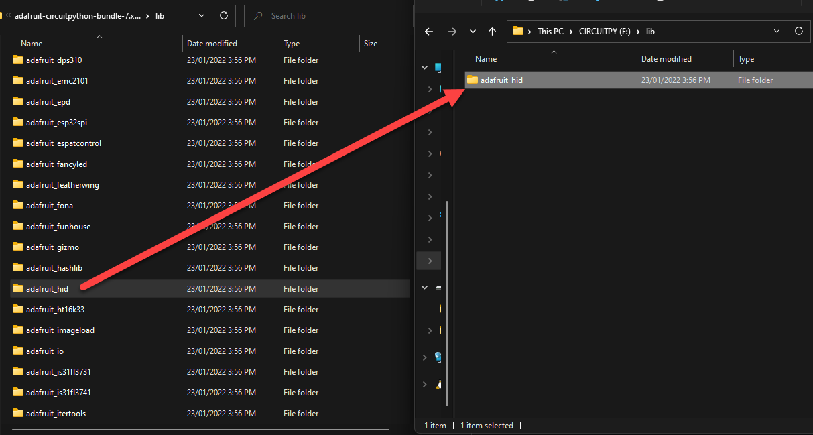

# Task 2: Setting up hard switch, LED and basic keyboard

Task 1, We set up the Pico and the development environment. A test program was run on the device to show a flashing light. This task, we will extend this to perform a flashing light based on a switch. This will confirm we can get input. Then we will send a keyboard key based on the button press.

The program used last task was:

```python
import time
import board
import digitalio
 
led = digitalio.DigitalInOut(board.LED)
led.direction = digitalio.Direction.OUTPUT
 
while True:
    led.value = True
    time.sleep(0.5)
    led.value = False
    time.sleep(0.5)
```

We will extend this to add an external button. The following is the wiring used.



Next, we will add a button and replace the loop to fire when the button is pressed.

```python
# Import libraries
import time
import board
import digitalio

# Define the onbaord LED
led = digitalio.DigitalInOut(board.LED)
led.direction = digitalio.Direction.OUTPUT

# Define button
btn_attack = digitalio.DigitalInOut(board.GP18)
btn_attack.direction = digitalio.Direction.INPUT
btn_attack.pull = digitalio.Pull.DOWN

# Start with LED as off.
led.value = False

# Creating a loop to run and check for button.
while True:
    if btn_attack.value:
        led.value = True
        time.sleep(2.5)
        led.value = False
        time.sleep(0.5)
```

Now we have the device working with a button, time to try a sending a key.

A new library will be required. We will use the Adafruit Keyboard Human Interface Device: <https://circuitpython.readthedocs.io/projects/hid/en/latest/>

Sending keys use a keycode, these can be found here: <https://circuitpython.readthedocs.io/projects/hid/en/latest/api.html#adafruit-hid-keycode-keycode>

First, we need to prepare our device. To do this we need to download the library files from here: <https://circuitpython.org/libraries>

Once downloaded extract the file and copy the HID library from to the PICO Lib file.



This requires adding the library to the import, then setting up the object. Once setup we will try turning our LED on and sending the F1 key.

```python
# Import libraries
import time
import board
import digitalio

# Import USB HID library
import usb_hid

# Import the Keyboard library and define the kaybaord type.
from adafruit_hid.keyboard import Keyboard
from adafruit_hid.keyboard_layout_us import KeyboardLayoutUS
from adafruit_hid.keycode import Keycode

# define the keybaord 
keyboard = Keyboard(usb_hid.devices)
keyboard_layout = KeyboardLayoutUS(keyboard) 

# Define the onbaord LED
led = digitalio.DigitalInOut(board.LED)
led.direction = digitalio.Direction.OUTPUT

# Define button
btn_attack = digitalio.DigitalInOut(board.GP18)
btn_attack.direction = digitalio.Direction.INPUT
btn_attack.pull = digitalio.Pull.DOWN

# Start with LED as off.button.
led.value = False

# Creating a loop to run and check for 
while True:
    if btn_attack.value:
        led.value = True
        time.sleep(2.5)
        keyboard.press(Keycode.F1)
        time.sleep(0.1)
        keyboard.release(Keycode.F1)
        led.value = False
        time.sleep(0.5)
```

Running the code, now when I press the button, F1 is sent to the computer.

Once completed move onto Task 3.

* [Task 1: The Pico and Setup of envirnoment](https://github.com/CraigWilsonOZ/PicoProject-Ducky/blob/main/Task%201/readme.md)
* [Task 2: Setting up hard switch, LED and basic keyboard](https://github.com/CraigWilsonOZ/PicoProject-Ducky/blob/main/Task%202/readme.md)
* [Task 3: Loading files and sending keys](https://github.com/CraigWilsonOZ/PicoProject-Ducky/blob/main/Task%203/readme.md)
* [Task 4: Creating scripts and basic payloads](https://github.com/CraigWilsonOZ/PicoProject-Ducky/blob/main/Task%204/readme.md)
* [Task 5: Working with Payloads](https://github.com/CraigWilsonOZ/PicoProject-Ducky/blob/main/Task%205/readme.md)
