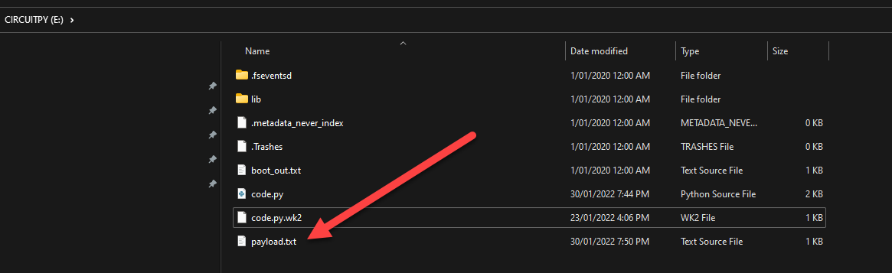

# Task 3: Loading files and sending keys

The PICO is now working as a virtual keyboard. The next step is to read it from a file and send keys. It's the first stage of delivering a payload.

The program used in the last task was:

```python
# Import libraries
import time
import board
import digitalio

# Import USB HID library
import usb_hid

# Import the Keyboard library and define the kaybaord type.
from adafruit_hid.keyboard import Keyboard
from adafruit_hid.keyboard_layout_us import KeyboardLayoutUS
from adafruit_hid.keycode import Keycode

# define the keybaord
keyboard = Keyboard(usb_hid.devices)
keyboard_layout = KeyboardLayoutUS(keyboard)

# Define the onbaord LED
led = digitalio.DigitalInOut(board.LED)
led.direction = digitalio.Direction.OUTPUT

# Define button
btn_attack = digitalio.DigitalInOut(board.GP18)
btn_attack.direction = digitalio.Direction.INPUT
btn_attack.pull = digitalio.Pull.DOWN

# Start with LED as off.button.
led.value = False

# Creating a loop to run and check for
while True:
    if btn_attack.value:
        led.value = True
        time.sleep(2.5)
        keyboard.press(Keycode.F1)
        time.sleep(0.1)
        keyboard.release(Keycode.F1)
        led.value = False
        time.sleep(0.5)
```

I will keep the same wiring and external switch to tell the PICO to send the message.

Next, we need to read a file. To do this, we will add the following lines of code to existing after the led.value line. This will an array of keys.1

```python
# Start with LED as off.button.
led.value = False

# Create and array for keys
command_list = {
    'A': Keycode.A, 'B': Keycode.B, 'C': Keycode.C, 'D': Keycode.D, 'E': Keycode.E,
    'F': Keycode.F, 'G': Keycode.G, 'H': Keycode.H, 'I': Keycode.I, 'J': Keycode.J,
    'K': Keycode.K, 'L': Keycode.L, 'M': Keycode.M, 'N': Keycode.N, 'O': Keycode.O,
    'P': Keycode.P, 'Q': Keycode.Q, 'R': Keycode.R, 'S': Keycode.S, 'T': Keycode.T,
    'U': Keycode.U, 'V': Keycode.V, 'W': Keycode.W, 'X': Keycode.X, 'Y': Keycode.Y,
    'Z': Keycode.Z
}
```

Next, we will create two functions. One to read the file and the other to run the lines.

```python
def runLine(line):
    for key in line:
        keyboard.press(command_list.get(key, None))
    keyboard.release_all()

def runPayLoadTest(file):
    ScriptFile = file
    inputfile = open(ScriptFile, 'r' , encoding='utf-8')
    PayLoadScript = inputfile.readlines()
    for line in PayLoadScript:
        line = line.rstrip()
        runLine(line)
        time.sleep(1.0)
```

The last thing is to update our While loop.

```python
while True:
    if btn_attack.value:
        led.value = True
        time.sleep(1.0)
        runPayLoadTest('payload.txt')
        time.sleep(1.0)
        led.value = False
        time.sleep(0.5)
```

The last step is to create a payload. Let's start with Hello World.

Create a file on the root of the PICO, the same place as we did for code.py. Call it payload.txt and place one letter per line for testing.

```bash
H
E
L
L
O
W
O
R
L
D
```

Now we have the device working with a button, reading a file and sending one key at a time to the device. We have completed the first part. Next, we need to allow a script payload to run.




In the next task, will be updating the script to read a payload script to send a full payload.

Full Code:

```python
# Import libraries
import time
import board
import digitalio

# Import USB HID library
import usb_hid

# Import the Keyboard library and define the kaybaord type.
from adafruit_hid.keyboard import Keyboard
from adafruit_hid.keyboard_layout_us import KeyboardLayoutUS
from adafruit_hid.keycode import Keycode

# define the keybaord 
keyboard = Keyboard(usb_hid.devices)
keyboard_layout = KeyboardLayoutUS(keyboard) 

# Define the onbaord LED
led = digitalio.DigitalInOut(board.LED)
led.direction = digitalio.Direction.OUTPUT

# Define button
btn_attack = digitalio.DigitalInOut(board.GP18)
btn_attack.direction = digitalio.Direction.INPUT
btn_attack.pull = digitalio.Pull.DOWN

# Start with LED as off.button.
led.value = False

# Create and array for keys
command_list = {
    'A': Keycode.A, 'B': Keycode.B, 'C': Keycode.C, 'D': Keycode.D, 'E': Keycode.E,
    'F': Keycode.F, 'G': Keycode.G, 'H': Keycode.H, 'I': Keycode.I, 'J': Keycode.J,
    'K': Keycode.K, 'L': Keycode.L, 'M': Keycode.M, 'N': Keycode.N, 'O': Keycode.O,
    'P': Keycode.P, 'Q': Keycode.Q, 'R': Keycode.R, 'S': Keycode.S, 'T': Keycode.T,
    'U': Keycode.U, 'V': Keycode.V, 'W': Keycode.W, 'X': Keycode.X, 'Y': Keycode.Y,
    'Z': Keycode.Z
}

def runLine(line):
    for key in line:
        keyboard.press(command_list.get(key, None))
    keyboard.release_all()

def runPayLoadTest(file):
    ScriptFile = file
    inputfile = open(ScriptFile, 'r' , encoding='utf-8')
    PayLoadScript = inputfile.readlines()
    for line in PayLoadScript:
        line = line.rstrip()
        runLine(line)
        time.sleep(1.0)

while True:
    if btn_attack.value:
        led.value = True
        time.sleep(1.0)
        runPayLoadTest('payload.txt')
        time.sleep(1.0)
        led.value = False
        time.sleep(0.5)
```

Once completed move onto Task 4.
