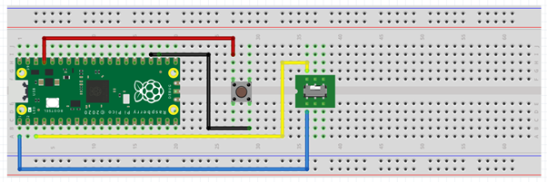
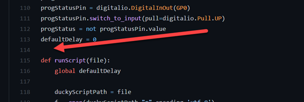
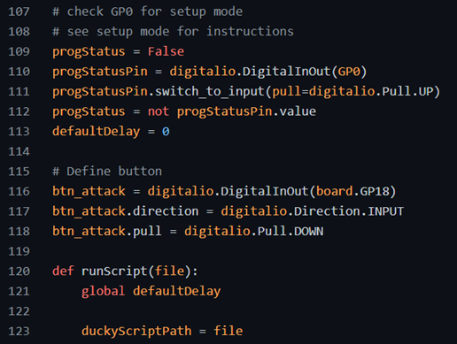
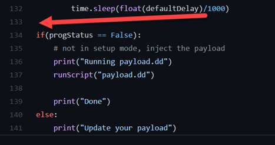
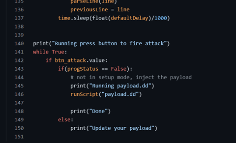
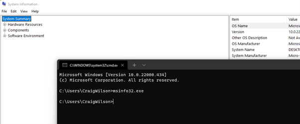

# Task 4: Creating scripts and basic payloads

Last few tasks, we got the PICO working as a remote keyboard. We were able to send keys to the computer. To protect me and I have added a trigger with an external button. The trigger will stop me from running a possible dangerous stript.

Next, we need to look at the scripts. Darren from the company Hak5.org produced a product called the Rubber Ducker. There is no point in creating a new language for this project; I will reuse the same script syntax as him.

The Hak5 Rubber Ducky script syntax can be found here: <https://github.com/hak5darren/USB-Rubber-Ducky/wiki/Duckyscript>

Next, we need to update my base code to work with the scripts. Lucky someone has already created a PICO ducky script. I will be using this as the base. It's almost the same style as mine; they have already worked out the logic to read the script syntax.

<https://github.com/dbisu/pico-ducky>

First, we need to update our board to enable storage visibility. We will use a switch to toggle between setup mode and payload mode.



Create a boot.py file. This file is used when the device boots and shows the PICO as a USB storage device or hides it. Take the boot.py code from the PICO-Ducky repo <https://github.com/dbisu/pico-ducky>. The best option is to fork the repo, which I have done here: <https://github.com/CraigWilsonOZ/pico-ducky>

Code for the file is:

```python
from board import *
import digitalio
import storage

noStorageStatus = False
noStoragePin = digitalio.DigitalInOut(GP15)
noStoragePin.switch_to_input(pull=digitalio.Pull.UP)
noStorageStatus = not noStoragePin.value

if(noStorageStatus == True):
    # don't show USB drive to host PC
    storage.disable_usb_drive()
    print("Disabling USB drive")
else:
    # normal boot
    print("USB drive enabled")
```

Next, we will update the codebase. The code provided has a catch-all trigger trap that allows you to run in setup mode.

```python
# check GP0 for setup mode

# see setup mode for instructions

progStatus = False
progStatusPin = digitalio.DigitalInOut(GP0)
progStatusPin.switch_to_input(pull=digitalio.Pull.UP)
progStatus = not progStatusPin.value
defaultDelay = 0
```

I still want to trigger the task by switching; I will add my push button switch into the code.

At Line 114, Add the following code:



Code:

```python
# Define button

btn_attack = digitalio.DigitalInOut(board.GP18)
btn_attack.direction = digitalio.Direction.INPUT
btn_attack.pull = digitalio.Pull.DOWN
```



Next, update the loop to fire when the button is pressed. At line 133, add the following code:



Code:

```python
While True:
if(progStatus == False):
    # not in setup mode, inject the payload
    print("Running payload.dd")
    runScript("payload.dd")

    print("Done")
else:
    print("Update your payload")
```



Now that we have the PICO ready for action, let's work on Payload. To do the Payload, I will be updating the Payload.py file.

Update the Payload.py file with the following code:

```bash
REM Echo Hello World! and start msinfo32.exe
GUI r
DELAY 250
STRING cmd
ENTER
DELAY 250
STRING echo Hello World!
ENTER
DELAY 250
STRING msinfo32.exe
ENTER
```

The script will perform a Windows Key + R to open a run prompt. Then open a command prompt. The script will then echo "Hello World!" and fire MSINFO32.exe.

So running the code on the PICO, we get this:



Success! We now have a PICO Ducky up and running. I have tested it on both Windows and Linux, and it runs basic commands.

Next week, I will update the payloads and test different actions on devices.

Full Code:

```python
# License : GPLv2.0
# copyright (c) 2021  Dave Bailey, Craig Wilson
# Author: Craig Wilson (craigwilsonoz) and original by Dave Bailey (dbisu, @daveisu)

import usb_hid
from adafruit_hid.keyboard import Keyboard

# comment out these lines for non_US keyboards
from adafruit_hid.keyboard_layout_us import KeyboardLayoutUS as KeyboardLayout
from adafruit_hid.keycode import Keycode

# uncomment these lines for non_US keyboards
# replace LANG with appropriate language
# from keyboard_layout_win_LANG import KeyboardLayout
# from keycode_win_LANG import Keycode

import time
import digitalio
import board

# from board import *

led = digitalio.DigitalInOut(board.LED)
led.direction = digitalio.Direction.OUTPUT

duckyCommands = {
    "WINDOWS": Keycode.WINDOWS,
    "GUI": Keycode.GUI,
    "APP": Keycode.APPLICATION,
    "MENU": Keycode.APPLICATION,
    "SHIFT": Keycode.SHIFT,
    "ALT": Keycode.ALT,
    "CONTROL": Keycode.CONTROL,
    "CTRL": Keycode.CONTROL,
    "DOWNARROW": Keycode.DOWN_ARROW,
    "DOWN": Keycode.DOWN_ARROW,
    "LEFTARROW": Keycode.LEFT_ARROW,
    "LEFT": Keycode.LEFT_ARROW,
    "RIGHTARROW": Keycode.RIGHT_ARROW,
    "RIGHT": Keycode.RIGHT_ARROW,
    "UPARROW": Keycode.UP_ARROW,
    "UP": Keycode.UP_ARROW,
    "BREAK": Keycode.PAUSE,
    "PAUSE": Keycode.PAUSE,
    "CAPSLOCK": Keycode.CAPS_LOCK,
    "DELETE": Keycode.DELETE,
    "END": Keycode.END,
    "ESC": Keycode.ESCAPE,
    "ESCAPE": Keycode.ESCAPE,
    "HOME": Keycode.HOME,
    "INSERT": Keycode.INSERT,
    "NUMLOCK": Keycode.KEYPAD_NUMLOCK,
    "PAGEUP": Keycode.PAGE_UP,
    "PAGEDOWN": Keycode.PAGE_DOWN,
    "PRINTSCREEN": Keycode.PRINT_SCREEN,
    "ENTER": Keycode.ENTER,
    "SCROLLLOCK": Keycode.SCROLL_LOCK,
    "SPACE": Keycode.SPACE,
    "TAB": Keycode.TAB,
    "BACKSPACE": Keycode.BACKSPACE,
    "A": Keycode.A,
    "B": Keycode.B,
    "C": Keycode.C,
    "D": Keycode.D,
    "E": Keycode.E,
    "F": Keycode.F,
    "G": Keycode.G,
    "H": Keycode.H,
    "I": Keycode.I,
    "J": Keycode.J,
    "K": Keycode.K,
    "L": Keycode.L,
    "M": Keycode.M,
    "N": Keycode.N,
    "O": Keycode.O,
    "P": Keycode.P,
    "Q": Keycode.Q,
    "R": Keycode.R,
    "S": Keycode.S,
    "T": Keycode.T,
    "U": Keycode.U,
    "V": Keycode.V,
    "W": Keycode.W,
    "X": Keycode.X,
    "Y": Keycode.Y,
    "Z": Keycode.Z,
    "F1": Keycode.F1,
    "F2": Keycode.F2,
    "F3": Keycode.F3,
    "F4": Keycode.F4,
    "F5": Keycode.F5,
    "F6": Keycode.F6,
    "F7": Keycode.F7,
    "F8": Keycode.F8,
    "F9": Keycode.F9,
    "F10": Keycode.F10,
    "F11": Keycode.F11,
    "F12": Keycode.F12,
}


def convertLine(line):
    newline = []
    # print(line)
    # loop on each key - the filter removes empty values
    for key in filter(None, line.split(" ")):
        key = key.upper()
        # find the keycode for the command in the list
        command_keycode = duckyCommands.get(key, None)
        if command_keycode is not None:
            # if it exists in the list, use it
            newline.append(command_keycode)
        elif hasattr(Keycode, key):
            # if it's in the Keycode module, use it (allows any valid keycode)
            newline.append(getattr(Keycode, key))
        else:
            # if it's not a known key name, show the error for diagnosis
            print(f"Unknown key: <{key}>")
    # print(newline)
    return newline


def runScriptLine(line):
    for k in line:
        kbd.press(k)
    kbd.release_all()


def sendString(line):
    layout.write(line)


def parseLine(line):
    global defaultDelay
    if line[0:3] == "REM":
        # ignore ducky script comments
        pass
    elif line[0:5] == "DELAY":
        time.sleep(float(line[6:]) / 1000)
    elif line[0:6] == "STRING":
        sendString(line[7:])
    elif line[0:5] == "PRINT":
        print("[SCRIPT]: " + line[6:])
    elif line[0:6] == "IMPORT":
        runScript(line[7:])
    elif line[0:13] == "DEFAULT_DELAY":
        defaultDelay = int(line[14:]) * 10
    elif line[0:12] == "DEFAULTDELAY":
        defaultDelay = int(line[13:]) * 10
    elif line[0:3] == "LED":
        if led.value:
            led.value = False
        else:
            led.value = True
    else:
        newScriptLine = convertLine(line)
        runScriptLine(newScriptLine)


kbd = Keyboard(usb_hid.devices)
layout = KeyboardLayout(kbd)

# sleep at the start to allow the device to be recognized by the host computer
time.sleep(0.5)

# check GP0 for setup mode
# see setup mode for instructions
progStatus = False
progStatusPin = digitalio.DigitalInOut(board.GP0)
progStatusPin.switch_to_input(pull=digitalio.Pull.UP)
progStatus = not progStatusPin.value
defaultDelay = 0

# Define button
btn_attack = digitalio.DigitalInOut(board.GP18)
btn_attack.direction = digitalio.Direction.INPUT
btn_attack.pull = digitalio.Pull.DOWN


def runScript(file):
    global defaultDelay

    duckyScriptPath = file
    f = open(duckyScriptPath, "r", encoding="utf-8")
    previousLine = ""
    duckyScript = f.readlines()
    for line in duckyScript:
        line = line.rstrip()
        if line[0:6] == "REPEAT":
            for i in range(int(line[7:])):
                # repeat the last command
                parseLine(previousLine)
                time.sleep(float(defaultDelay) / 1000)
        else:
            parseLine(line)
            previousLine = line
        time.sleep(float(defaultDelay) / 1000)


print("Running press button to fire attack")cmd

while True:
    if btn_attack.value:
        led.value = True
        time.sleep(0.5)
        led.value = False
        time.sleep(0.5)
        led.value = True
        time.sleep(0.5)
        led.value = False
        time.sleep(0.5)cmd
        print("Running payload.dd")
        runScript("payload.dd")
        print("Done")
```

Once completed move onto Task 5.
